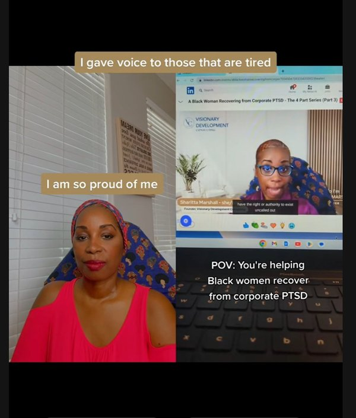

# SharittaMarshall.com — Portfolio Site PRD
**Version:** 1.0
**Date:** April 2026
**Status:** Pre-launch — pending content additions and deployment

---

## Purpose

This document tracks every section of sharittamarshall.com, what content it requires, its current completion status, what still needs to be done, and the order to do it in. Use this as the single source of truth before and after launch.

---

## Folder Structure (on your computer)

```
SharittaMarshall-Portfolio/
├── assets/
│   ├── sharitta-hero.jpg        ← headshot (glass background) ✅ LOADED
│   ├── sharitta-about.jpg       ← orange chair photo          ✅ LOADED
│   ├── work-okra.jpg            ← O'Kra lifestyle photo       ✅ LOADED (placeholder only)
│   └── work-ugc.jpg             ← white dress product shoot   ✅ LOADED
├── index.html                   ← the entire website          ✅ COMPLETE
├── package.json                 ← Railway config              ✅ COMPLETE
├── railway.toml                 ← Railway config              ✅ COMPLETE
└── README.md                    ← deployment instructions     ✅ COMPLETE
```

---

## Section-by-Section Status

### 1. Navigation Bar
**Status:** ✅ Complete

| Element | Content | Status |
|---|---|---|
| Logo | Sharitta Marshall | ✅ Done |
| Nav links | About, Content, Media, Work, Services | ✅ Done |
| CTA button | Work With Me | ✅ Done |

Nothing to update.

---

### 2. Hero Section
**Status:** ⚠️ 90% complete — one item pending

| Element | Content | Status |
|---|---|---|
| Your name | Sharitta Marshall | ✅ Done |
| Title | Career Villain | ✅ Done |
| Tagline | Work Well. Live Better. No Apologies. | ✅ Done |
| Bio | UGC creator, app builder, radio host... | ✅ Done |
| Buttons | Work With Me / View My Work | ✅ Done |
| Hero photo | Headshot (glass background) | ✅ Loaded |
| Engagement badge | 4.8% | ✅ Done |

**Pending:**
- Update the 4.8% badge number any time your actual engagement rate changes

---

### 3. Stats Bar
**Status:** ✅ Complete — update numbers as they grow

| Stat | Current Value | Status |
|---|---|---|
| Followers | 3,626 | ✅ Set |
| Female Audience | 74% | ✅ Set |
| Monthly Reach | 4,700 | ✅ Set |
| Engagement Rate | 4.8% | ✅ Set |

**Ongoing:** Update these numbers in `index.html` every time your stats change. Search for `3,626` and replace all four values.

---

### 4. About Section
**Status:** ✅ Complete

| Element | Content | Status |
|---|---|---|
| Photo | Orange chair (Fun_2.jpg) | ✅ Loaded |
| Pull quote | "Done being overlooked. Built to stand out." | ✅ Done |
| Tags | UGC Creator, Strategist, App Builder, Radio Host, TikTok, Phoenix AZ | ✅ Done |
| Bio paragraph 1 | Sharitta Marshall is a personal and professional development creator... | ✅ Done |
| Bio paragraph 2 | Her content reaches career-focused professionals... | ✅ Done |
| Impact Weaver chip | Founder, Impact Weaver — Career documentation app built with AI | ✅ Done |

Nothing to update.

---

### 5. Content Pillars
**Status:** ✅ Complete

| Pillar | Title | Status |
|---|---|---|
| 01 | The Career Villain Life | ✅ Done |
| 02 | The Villain Travels | ✅ Done |
| 03 | The Villain's Table | ✅ Done |
| 04 | Sips Without the Hangover | ✅ Done |

Nothing to update. The "View Content" arrows currently scroll nowhere — in a future update these can link to your TikTok filtered by hashtag or playlist.

---

### 6. Media Presence
**Status:** ✅ Complete

| Card | Platform | Detail | Status |
|---|---|---|---|
| 1 | TikTok | @herdivinealchemy · 2,587 followers | ✅ Done |
| 2 | Instagram | @sharittamarshall · 693 followers · 5.5% ER | ✅ Done |
| 3 | WJZD Radio Detroit | Weekly Saturday segment | ✅ Done |

**Ongoing:** Update follower counts as they grow.

---

### 7. Work / Portfolio Section
**Status:** ⚠️ Partially complete — 2 of 3 cards pending video content

| Card | Subject | Type | Current State | Action Needed |
|---|---|---|---|---|
| 1 | The Career Villain Life | Video | Placeholder | Film a TikTok, add screenshot + link |
| 2 | O'Kra Water Ambassador | Video | Placeholder | Film O'Kra TikTok, add screenshot + link |
| 3 | Product Lifestyle Shoot | Static photo | ✅ Real photo loaded | None |

**How to add a real TikTok to cards 1 and 2:**

Step 1 — Take a screenshot of the TikTok video thumbnail on your phone

Step 2 — Save it to your assets folder as:
- `work-career.jpg` for card 1
- `work-okra-video.jpg` for card 2

Step 3 — In `index.html`, find the card and replace:
```html
<div class="wph"><span>🎯</span><p>Add TikTok screenshot + link</p></div>
```
With:
```html

```

Step 4 — Wrap the entire `wcard` div in an anchor tag linking to the TikTok URL:
```html
<a href="https://tiktok.com/@herdivinealchemy/video/YOUR_VIDEO_ID" target="_blank" rel="noreferrer">
  <div class="wcard reveal">
    ...
  </div>
</a>
```

Step 5 — Push to GitHub. Railway redeploys in 30 seconds.

---

### 8. Services Section
**Status:** ✅ Complete — no rates shown by design

| Service | Status |
|---|---|
| UGC Video Content | ✅ Done |
| Photo + Static Content | ✅ Done |
| Brand Partnerships | ✅ Done |

All "Get a Quote" buttons link to the Contact section. This is intentional so brands reach out before seeing numbers.

---

### 9. Brands Section
**Status:** ✅ Complete

| Tier | Brands | Status |
|---|---|---|
| Confirmed | O'Kra Water (Ambassador), Impact Weaver (Founder) | ✅ Done |
| Wishlist | Fenty, The Doux, Black Girl Vitamins, Calypso, Delta, Hilton, Sensori, Upful Blends, Toyota, Ulta | ✅ Done |

**Ongoing:** As you land new deals, move brands from the wishlist tiles to the Confirmed row. Update the label from grid tile to `btile conf` with a `cbadge`.

---

### 10. Contact Section
**Status:** ✅ Complete

| Element | Content | Status |
|---|---|---|
| Email button | sharitta.marshall818@gmail.com | ✅ Done |
| View Media Kit | canva.link/79b9rpp72lkj98x | ✅ Done (live Canva link) |
| TikTok link | @herdivinealchemy | ✅ Done |
| Instagram link | @sharittamarshall | ✅ Done |
| WJZD Radio | Text only (no link needed) | ✅ Done |
| Impact Weaver | impactweaverapp.com | ✅ Done |

**Note:** The Canva media kit link is live. Every time you update your Canva kit, this button automatically shows the latest version. No code changes needed.

---

### 11. Footer
**Status:** ✅ Complete

Content: `2026 Sharitta Marshall · Career Villain · Visionary Development Inc`

---

## Pre-Launch Checklist

Complete these in order before going live:

```
Step 1 ☐  Download index.html from this chat (latest version)
Step 2 ☐  Download all assets from this chat
Step 3 ☐  Confirm folder structure matches the diagram at the top of this doc
Step 4 ☐  Open index.html in your browser — confirm all 3 photos load
Step 5 ☐  Remove the note "Update with your real TikTok handle before publishing"
           from the work section in index.html (search for it and delete that line)
Step 6 ☐  Push to GitHub (see README.md for exact commands)
Step 7 ☐  Create new Railway project from GitHub repo
Step 8 ☐  Connect custom domain sharittamarshall.com in Railway settings
Step 9 ☐  Confirm site is live at sharittamarshall.com
Step 10 ☐ Submit TikTok Direct Post audit at developers.tiktok.com
           (runs in background — 1-2 weeks)
```

---

## Post-Launch Updates (do these after site is live)

### Immediate (week 1)
- Film Career Villain Life TikTok, add screenshot + link to card 1
- Film O'Kra Water TikTok, add screenshot + link to card 2

### Ongoing
- Update stats (followers, reach, engagement) monthly
- Add new TikTok work cards as you create brand content
- Move wishlist brands to Confirmed when deals close
- Update media kit in Canva (site link auto-updates)

### Phase 2 additions (future)
- Add a fourth work card row for The Villain Travels content
- Add testimonials section below Services when you have them
- Link pillar arrows to TikTok hashtag pages or playlists
- Add a "Press" section once radio segment has a recording or clip

---

## Site Colors (for reference when editing)

| Use | Hex |
|---|---|
| Primary purple (buttons, accents) | #4B1A8C |
| Deep purple (stats bar, footer) | #2D0F5C |
| Purple accent (wave, hover) | #7B4FBB |
| Very light purple tint | #EDE7F6 |
| Page background | #FAFAFA |
| White sections | #FFFFFF |
| Main text | #150A2E |
| Muted text | #7B6A9B |

---

## Handles and Links (quick reference)

| Item | Value |
|---|---|
| TikTok | @herdivinealchemy |
| Instagram | @sharittamarshall |
| Email | sharitta.marshall818@gmail.com |
| Canva media kit | canva.link/79b9rpp72lkj98x |
| Impact Weaver | impactweaverapp.com |
| Radio | WJZD · Detroit · Saturdays |
| Domain | sharittamarshall.com |
| Repository | SharittaMarshall-Portfolio (GitHub) |
| Hosting | Railway |
